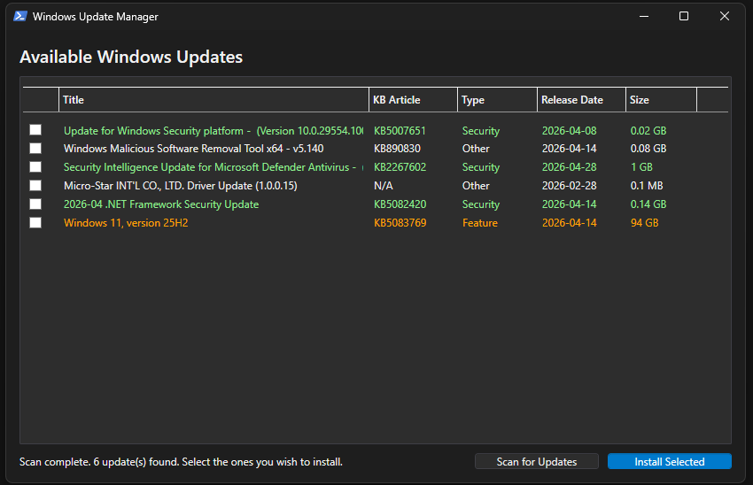

# Windows Updater GUI

A modern, dark-themed PowerShell script that provides a graphical user interface (GUI) for managing Windows Updates. This tool simplifies the process of scanning, selecting, and installing updates on a Windows machine.




---

## Features

-   **User-Friendly GUI:** A clean, modern, dark-themed interface built with WPF.
-   **Automatic Dependency Management:** Automatically checks for and installs the required `PSWindowsUpdate` module from the PowerShell Gallery.
-   **Scan for Updates:** Easily scan for all available Windows updates with a single click.
-   **Selective Installation:** View a list of available updates and select which ones to install using checkboxes.
-   **Detailed Information:** Displays key details for each update, including:
    -   KB Article ID
    -   Update Title
    -   Size (in MB or GB)
    -   Release Date
-   **Update Categorization:** Updates are color-coded and prefixed for easy identification:
    -   `[FULL VERSION UPDATE]` (Red)
    -   `[FEATURE UPDATE]` (Orange)
    -   `[SECURITY UPDATE]` (Green)
    -   `[OTHER UPDATE]` (White)
-   **Real-time Status:** A status bar provides feedback on the current operation (scanning, installing, complete).
-   **Responsive Interface:** The GUI remains responsive during long-running scan and install operations.
-   **Detailed Console Logging:** All actions are logged to the PowerShell console for detailed progress tracking.

## Requirements

-   **Operating System:** Windows 10 or newer.
-   **PowerShell:** PowerShell 5.1 or later.
-   **Permissions:** Must be run with Administrator privileges. The script includes a `#Requires -RunAsAdministrator` directive to enforce this.
-   **Internet Connection:** Required to download the `PSWindowsUpdate` module (on first run) and the Windows updates themselves.

## How to Use

1.  **Download:** Save the `WindowsUpdaterGUI.ps1` script to your computer.
2.  **Execution Policy:** You may need to adjust your PowerShell execution policy to run the script. You can set it for the current process by running the following command in a PowerShell terminal:
    ```powershell
    Set-ExecutionPolicy -ExecutionPolicy Bypass -Scope Process
    ```
3.  **Run:**
    -   Right-click the `WindowsUpdaterGUI.ps1` file.
    -   Select **"Run with PowerShell"**.
    -   The script will automatically request Administrator elevation if not already elevated.

Once the application window appears:
1.  Click **"Scan for Updates"** to search for available updates.
2.  Wait for the scan to complete. The list will populate with any updates found.
3.  Check the boxes next to the updates you wish to install.
4.  Click **"Install Selected"** to begin the installation process.
5.  Monitor the GUI status bar and the underlying PowerShell console for progress.

## Disclaimer

This script is provided as-is. While it is designed to be safe, you are responsible for the updates you choose to install. Always ensure you have backups of important data before performing system updates. Use this tool at your own risk.

## License

This project is licensed under the MIT License - see the [LICENSE](LICENSE) file for details.
